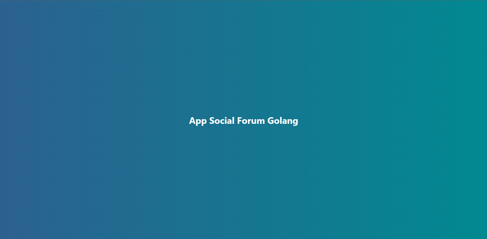
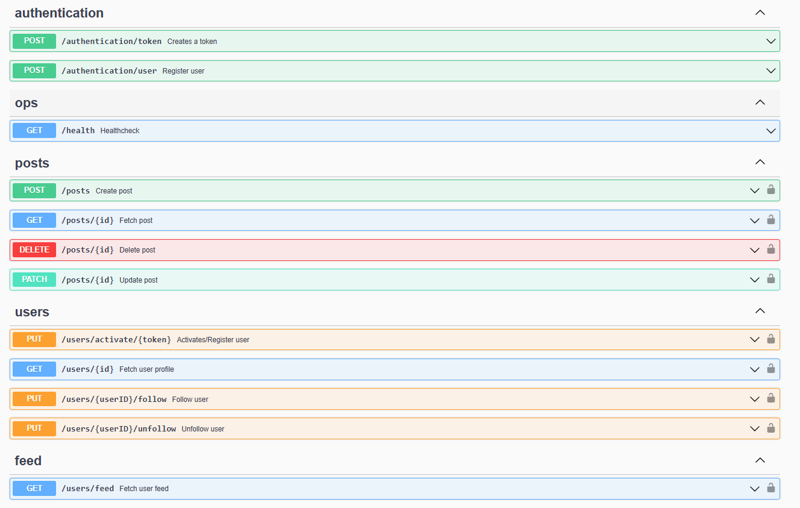
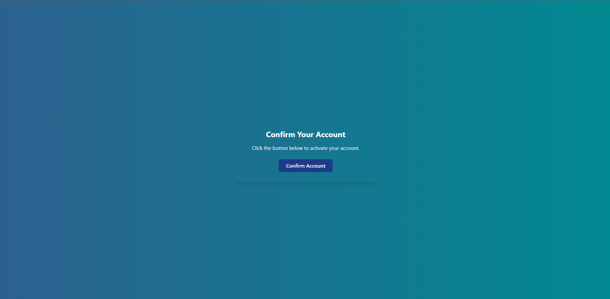

# Social API

Современный REST API для социального форума, разработанный на Go. Включает аутентификацию пользователей, управление постами, систему подписок и персонализированные ленты с поддержкой кэширования.

## Возможности

- **Управление пользователями**: Регистрация, аутентификация и профили
- **Посты**: Создание, чтение, обновление и удаление постов с тегами
- **Социальные функции**: Подписки/отписки на пользователей и персональная лента
- **Комментарии**: Добавление комментариев к постам с информацией об авторе
- **Аутентификация**: JWT-токены с контролем доступа на основе ролей
- **Кэширование**: Интеграция Redis для повышения производительности
- **Ограничение частоты запросов**: Rate limiter для предотвращения злоупотреблений
- **Email-уведомления**: Интеграция с Mailtrap для приглашений пользователей
- **API документация**: Swagger/OpenAPI документация
- **Миграции БД**: Автоматизированное управление схемой данных

## Стек технологий

- **Язык**: Go 1.24.4
- **Framework**: Chi (HTTP router и middleware)
- **БД**: PostgreSQL
- **Кэш**: Redis
- **Аутентификация**: JWT с golang-jwt
- **Валидация**: go-playground/validator
- **Email**: Mailtrap SMTP сервис
- **API документация**: Swagger/OpenAPI
- **Frontend**: React + Vite + Tailwind CSS

## 📸 Скриншоты

<div align="center">

### Главная страница



---

### Swagger API Documentation



---

### Страница подтверждения email



</div>

## Структура проекта

```
.
├── cmd/
│   ├── api/                 # Основное API приложение
│   │   ├── api.go          # Роуты и настройка сервера
│   │   ├── auth.go         # Хендлеры аутентификации
│   │   ├── middleware.go   # Кастомные middleware
│   │   ├── posts.go        # Хендлеры постов
│   │   ├── users.go        # Хендлеры пользователей
│   │   └── ...
│   └── migrate/            # Миграции БД
│       ├── migrations/     # SQL файлы миграций
│       └── seed/           # Сидирование БД
├── internal/
│   ├── auth/               # Логика аутентификации
│   ├── db/                 # Инициализация БД
│   ├── env/                # Helpers переменных окружения
│   ├── mailer/             # Email сервис
│   ├── ratelimiter/        # Реализация rate limiting
│   ├── service/            # Бизнес-логика
│   └── store/              # Слой доступа к данным
│       └── cache/          # Слой кэширования
├── web/                    # React приложение
│   └── src/
├── docs/                   # Swagger документация
├── docker-compose.yml      # Конфигурация Docker сервисов
├── .github/workflows/      # CI/CD workflow
├── .gitignore
├── go.mod
├── Makefile
└── README.md
```

## API Endpoints

### Аутентификация

- `POST /v1/authentication/user` - Регистрация нового пользователя
- `POST /v1/authentication/token` - Получение JWT токена

### Пользователи

- `GET /v1/users/{id}` - Получить профиль пользователя
- `PUT /v1/users/{id}/follow` - Подписаться на пользователя
- `PUT /v1/users/{id}/unfollow` - Отписаться от пользователя
- `PUT /v1/users/activate/{token}` - Активировать аккаунт
- `GET /v1/users/feed` - Получить персональную ленту

### Посты

- `POST /v1/posts` - Создать пост
- `GET /v1/posts/{id}` - Получить пост
- `PATCH /v1/posts/{id}` - Обновить пост (модератор+)
- `DELETE /v1/posts/{id}` - Удалить пост (админ+)

### Операции

- `GET /v1/health` - Проверка здоровья сервера
- `GET /v1/debug/vars` - Метрики runtime (требует basic auth)

### API Документация

- `GET /v1/swagger/*` - Interactive Swagger UI

## Аутентификация

API использует JWT токены:

```
Authorization: Bearer <your-jwt-token>
```

### Роли пользователей

- **user** (уровень 1): Может создавать посты и комментарии
- **moderator** (уровень 2): Может обновлять посты других пользователей
- **admin** (уровень 3): Может удалять посты других пользователей

## Схема БД

Основные таблицы:

- **users**: Учетные записи пользователей с ролями
- **posts**: Посты, созданные пользователями
- **comments**: Комментарии к постам
- **followers**: Отношения подписок между пользователями
- **roles**: Определения ролей пользователей
- **user_invitations**: Токены для регистрации пользователей

Все таблицы создаются и управляются через миграции.

## Примеры использования API

### Регистрация пользователя

```bash
curl -X POST http://localhost:8080/v1/authentication/user \
  -H "Content-Type: application/json" \
  -d '{
    "username": "иван_иванов",
    "email": "ivan@example.com",
    "password": "securepassword"
  }'
```

### Получение токена

```bash
curl -X POST http://localhost:8080/v1/authentication/token \
  -H "Content-Type: application/json" \
  -d '{
    "email": "ivan@example.com",
    "password": "securepassword"
  }'
```

### Создание поста

```bash
curl -X POST http://localhost:8080/v1/posts \
  -H "Authorization: Bearer <token>" \
  -H "Content-Type: application/json" \
  -d '{
    "title": "Мой первый пост",
    "content": "Это содержимое моего поста",
    "tags": ["golang", "api"]
  }'
```

### Получение персональной ленты

```bash
curl -X GET "http://localhost:8080/v1/users/feed?limit=10&offset=0&sort=desc" \
  -H "Authorization: Bearer <token>"
```
